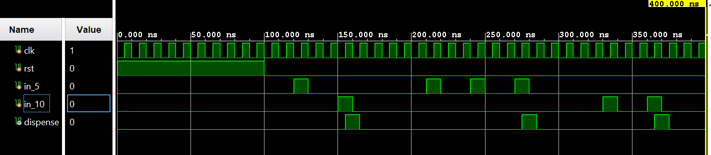

# Vending Machine Controller FSM in Verilog

A synchronous Finite State Machine (FSM) implementation of a vending machine controller written in Verilog. This project simulates a digital controller that accepts 5 Rs and 10 Rs coins, tracks the accumulated amount, and triggers a dispense signal when the total reaches 15 Rs.

## Project Overview

* **Product Price:** 15 Rs
* **Accepted Denominations:** 5 Rs, 10 Rs
* **Architecture:** Mealy/Moore hybrid FSM (Outputs based on state, state transitions based on clock and input).
* **Language:** Verilog HDL
* **Target Environment:** Simulation (Xilinx Vivado / ModelSim)
* **Hardware Target:** Hardware-agnostic (Deployable on any standard FPGA)

## State Machine Design

The FSM is designed using 4 distinct states, encoded using 2 bits:
* `S_0` (00): Initial state, 0 Rs accumulated.
* `S_5` (01): 5 Rs accumulated.
* `S_10` (10): 10 Rs accumulated.
* `S_15` (11): 15 Rs accumulated. (Dispense state, auto-resets to `S_0`).

### Truth Table (State Transitions)

| Current State (Q1 Q0) | Input 5 Rs | Input 10 Rs | Next State (Q1next Q0next) | Output (Dispense) | Description |
| :---: | :---: | :---: | :---: | :---: | :--- |
| **00 (0 Rs)** | 0 | 0 | **00 (0 Rs)** | 0 | Waiting for coin. |
| **00 (0 Rs)** | 1 | 0 | **01 (5 Rs)** | 0 | 5 Rs inserted. |
| **00 (0 Rs)** | 0 | 1 | **10 (10 Rs)** | 0 | 10 Rs inserted. |
| **01 (5 Rs)** | 0 | 0 | **01 (5 Rs)** | 0 | Waiting. |
| **01 (5 Rs)** | 1 | 0 | **10 (10 Rs)** | 0 | 5 + 5 = 10 Rs. |
| **01 (5 Rs)** | 0 | 1 | **11 (15 Rs)** | 0 | 5 + 10 = 15 Rs. |
| **10 (10 Rs)** | 0 | 0 | **10 (10 Rs)** | 0 | Waiting. |
| **10 (10 Rs)** | 1 | 0 | **11 (15 Rs)** | 0 | 10 + 5 = 15 Rs. |
| **10 (10 Rs)** | 0 | 1 | **11 (15 Rs)** | 0 | 10 + 10 = 20 Rs (Dispense triggers at $\ge$ 15). |
| **11 (15 Rs)** | X | X | **00 (0 Rs)** | 1 | **DISPENSE!** Auto-resets on next clock edge. |

*(Note: X = Don't Care)*

## Simulation Results & Waveform Analysis

The design was verified using a behavioral simulation in Xilinx Vivado. 

The waveform demonstrates the successful execution of three distinct test cases, governed by the `clk` signal and controlled by the `rst` (reset) signal[cite: 3]:
1. **System Initialization:** The `rst` signal remains high for the first 100.000 ns, keeping all outputs and states at zero[cite: 3].
2. **Test Case 1 (5 Rs + 10 Rs):** Following the reset, the `in_5` signal pulses high, followed shortly by the `in_10` signal[cite: 3]. The system successfully registers the 15 Rs total and drives the `dispense` output high for a single clock cycle[cite: 3].
3. **Test Case 2 (5 Rs + 5 Rs + 5 Rs):** The `in_5` signal pulses high three consecutive times[cite: 3]. The system tracks the accumulation and correctly triggers the `dispense` output high after the third pulse[cite: 3]. 
4. **Test Case 3 (10 Rs + 10 Rs Overpay):** The `in_10` signal pulses high twice[cite: 3]. The system recognizes the total has met or exceeded the 15 Rs threshold and triggers the `dispense` output high[cite: 3].

## Repository Structure

* `vending_machine.v` - The core FSM RTL design module.
* `tb_vending_machine.v` - The testbench simulating various user insertion sequences.

## How to Simulate

1. Open **Xilinx Vivado** and create a new RTL project.
2. Add `vending_machine.v` as a Design Source.
3. Add `tb_vending_machine.v` as a Simulation Source.
4. Set `tb_vending_machine` as the Top Module.
5. Click **Run Simulation** -> **Run Behavioral Simulation**.
